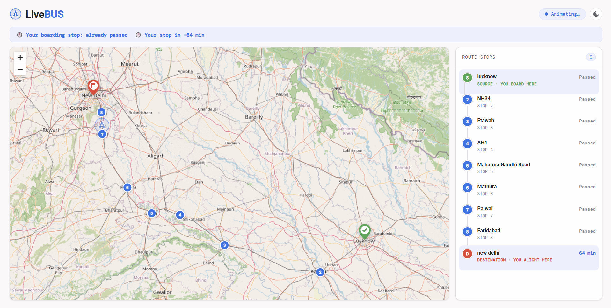
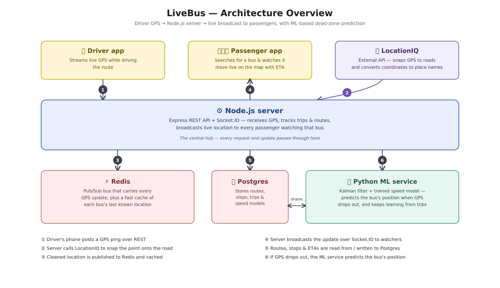

## 1. What Is This Service?

LiveBus Tracker is a bus tracking service. It basically answers **"Where is my bus right now?"**, similar to the **"Where Is My Train"** app.

It has **three separate programs** that work together.

|  | Service | Job |
|:-:|---------|-----|
| **1.** | **Node Server** | It receives GPS pings, talks to the database, manages trips & routes. |
| **2.** | **Python Predictor Server** | When a bus's GPS signal goes silent, this service predicts where the bus probably is right now, using math + machine learning. |
| **3.** | **Client** | Three web pages: one for the bus driver's phone, one for a passenger to search for a bus, and one showing a live animated map of the bus. |

---

There are also **two shared infrastructure components**:

| Component | Purpose |
|-----------|---------|
| **PostgreSQL database** | Stores routes, stops, trips. |
| **Redis** | Used for live location data, pub/sub messaging, and short-term buffers. |


<br>



<br>


## 2. Architecture




<br>

## 3. People Using the App

There are **two kinds of humans** using this app.

| User | What They Do |
|------|---------------|
| **Driver** | He starts a trip, and the app quietly sends the phone's GPS location to the server every **10 seconds**. |
| **Passenger** | He types where he is boarding from & where he want to go, after that he sees a list of currently running buses on that route, taps one, and is taken to a page which shows a live animated map of that bus moving in real time. |


<br>


## 4. Core Vocabulary

Before diving into the code, let's define the key nouns used throughout this codebase.

| Term      | Meaning |
|-----------|---------|
| **Route** | A path a bus travels, identified by a bus number + a source + a destination. |
| **Trip** | One actual journey along a route, happening *right now*. If the same bus does the Lucknow→Delhi route every day, each day is a separate **Trip**, but they all belong to the same **Route**. |
| **Ping** | A single GPS reading sent from the driver's phone. |
| **Map-matching** | Raw GPS is often slightly off the road due to GPS error. Map-matching uses a third-party service (LocationIQ) to snap the noisy point onto the actual road. |
| **ETA** | Estimated Time of Arrival for the bus at each stop, calculated using how far along the route the bus currently is and how fast it typically travels on the remaining segments. |


<br>


## 5. The Database (PostgreSQL)

The database is **shared** between the Node server and the Python server — both connect to the *same* Postgres database, but each "owns" different tables. Node uses a tool called **Drizzle ORM** to define and manage its tables in TypeScript; Python just writes raw SQL against tables.


## Tables owned by Node

### `route`

One row = one unique bus path (bus number + source + destination).

<details>
<summary><strong>Columns</strong></summary>

| Column | Meaning |
|---|---|
| `routeId` | Unique ID |
| `bus_number` | The bus's license number |
| `source` | Starting place name  |
| `destination` | Ending place name  |
| `createdAt` / `updatedAt` | Timestamps |

</details>

There's a uniqueness rule: you can't have two rows with the same (bus_number, source, destination)

---

### `route_stop`

One row = one stop belonging to a route

<details>
<summary><strong>Columns</strong></summary>

| Column | Meaning |
|---|---|
| `id` | Unique ID |
| `routeId` | Which route this stop belongs to |
| `seq` | Order along the route  |
| `stopName` | Human-readable name |
| `lat`, `lng` | Coordinates |
| `isTerminal` | `true` if this is the very first or very last stop (source/destination) |
| `sampleCount` | How many GPS readings have been averaged into this stop's coordinates  |
| `resolved` | Whether we have "confirmed" real coordinates for this stop. |
| `createdAt` | Timestamp |

</details>

---

### `route_segment_speed`

One row = the average speed buses have historically traveled **between two specific consecutive stops** on a route. This is used for ETA calculations.

<details>
<summary><strong>Columns</strong></summary>

| Column | Meaning |
|---|---|
| `id` | Unique ID |
| `routeId` | Which route |
| `fromStopId` / `toStopId` | The two stops this speed applies between |
| `avgSpeedMps` | Running average speed (meters per second) |
| `sampleCount` | How many trips' worth of data went into this average |
| `createdAt` / `updatedAt` | Timestamps |

</details>

---

### `trip`

One row = one actual journey 

<details>
<summary><strong>Columns</strong></summary>

| Column | Meaning |
|---|---|
| `tripId` | Unique ID |
| `routeId` | Which route this trip follows |
| `status` | `"active"` (currently running) or `"completed"` (ended) |
| `current` | `true` if this is the **most recent** trip for this route  |
| `createdAt` / `updatedAt` / `endedAt` | Timestamps |

</details>


## Tables owned by Python

 

### `route_speed_training_sample`

One row = Raw historical speed observations, collected from **every completed trip**, used as training data for the machine-learning speed model.

<details>
<summary><strong>Columns</strong></summary>

| Column | Meaning |
|---|---|
| `id` | Auto-incrementing ID |
| `route_id` | Which route this sample is from |
| `progress_fraction` | A number from 0 to 1 representing how far along the route |
| `minute_of_day` | What time of day |
| `day_of_week` | Monday=0 ... Sunday=6 — helps the model learn "Sundays are faster" |
| `speed_mps` | The actual measured speed (meters/second) at that point |
| `created_at` | Timestamp |

</details>

---

### `route_speed_model`

Stores the actual trained ML model for a route, as a binary blob.

<details>
<summary><strong>Columns</strong></summary>

| Column | Meaning |
|---|---|
| `route_id` | Primary key — one model per route |
| `estimator_blob` | The trained model itself, serialized (saved) using a Python tool called `joblib`, stored as raw bytes (`BYTEA`) directly in Postgres |
| `residual_std` | How "noisy"/uncertain the model's predictions typically are |
| `sample_count` | How many training samples went into this version of the model |
| `updated_at` | Timestamp |

</details>


<br>

## 6. The Redis

Redis is an in-memory data store — meaning it's blazing fast but everything in it is temporary. It plays **four different roles** in this app.


## Role 1: Message Bus (Pub/Sub)

> **Purpose:** Passing messages between parts of the Node server.

Redis's "publish/subscribe" feature lets one piece of code **publish** a message onto a "channel," and any other piece of code **subscribed** to that channel instantly receives it.

This app uses two channels:

### `raw_location`

When a GPS ping arrives, the Node server doesn't process it right there. Instead, it just publishes the raw ping onto the `raw_location` channel and immediately responds "OK" to the phone. Meanwhile, a separate subscriber is listening on this channel and does the actual heavy work (map-matching, etc.) asynchronously.

### `processed_data`

After  cleaning up a raw ping (snapping it to the road, or getting a predicted position during a dead zone), it publishes the *cleaned* location onto `processed_data`. A different subscriber listens here and forwards it to all connected browsers via Socket.io.


## Role 2: Short-Term Location History

> **Purpose:** A sliding buffer of recent points.


Every time a location is processed, the clean point is appended to a Redis **list**. This list is a **complete history of every point in the current trip**, kept for up to 2 hours.

Two things use this history:

- When the trip ends, the whole list is used to build ML training samples.
- It effectively is the "black box flight recorder" for one trip.


## Role 3: "What's the bus's location right now?" Cache

> **Purpose:** Store the latest processed location for instant lookup.


Two places use this:

1. When a new browser tab starts tracking a bus , the server immediately sends this cached "last known location" so the map doesn't start blank.
2. The ETA calculation reads this to know where the bus currently is along the route.


## Role 4: Temporary "Pending Stops" Buffer

> **Purpose:** Store stops temporarily until the trip finishes.


When the driver taps "PIN STOP" mid-trip, the stop isn't written to the permanent database immediately — it's just appended to this Redis list.

Only when the trip **ends** does the server read this whole buffered list and write each stop properly into the `route_stop` table.


<br>


## 7. How a GPS Ping Flows Through the Whole System


```text
Driver's Phone
        │
        │ 
        ▼
POST /api/location/live 
        │
        ▼
Redis channel: "raw_location"
        │
        ▼
Redis Subscriber
        │
        ├─ 1. Call LocationIQ's Map Matching API.
        │
        ├─ 2. Append the clean to Redis order list.
        │
        ├─ 3. Publish the clean point to Redis channel "processed_data"
        │
        └─ 4. Remember this as last location.
        │
        ▼
Redis channel: "processed_data"
        │
        ▼
Redis Subscriber
        │
        └─> Socket.io — broadcasts to every browser that joined the room.
                   │
                   ▼
        Bus is live viewed in a map.
                   
```


<br>


## 8. What Happens When GPS Goes Silent.

Sometimes a phone stops sending pings (tunnel, no signal). The system watches for this and "fills in the gap" with an educated guess.


## Stage 1 — The Watchdog


> "Have I received a real ping for this trip in the last 20 seconds?"

If not, it calls `requestPredictedLocation(tripId)`.


## Stage 2 — Asking Python to Guess

`requestPredictedLocation` sends a `POST /predict` request to the Python FastAPI server, with:

- The bus's last known real position, velocity & timestamp
- The route it's on
- The current time


## Stage 3 — Inside the Python Predictor


 Step 1 : Find where on the route the last known point sits.


 Step 2 : Figure out how fast the bus is probably going right now.


 Step 3 : Run a Kalman Filter forward in time.


 Step 4 : Convert the final route-distance back into real GPS coordinates.

 Step 5 : Compute a confidence radius

 Step 6 : Send the result back to Node


## The "Speed Model" — How Does It Know Typical Speeds?

This is a small ML model (one per route), built with scikit-learn's `HistGradientBoostingRegressor` (a tree-based regression model — good at learning "if X and Y, then Z" patterns from data without needing much tuning).

- **Input features**: Progress fraction along the route, the time of day & the day of week.

- **Output:** Predicted speed in m/s.

- **Training data** comes from `route_speed_training_sample`.

- **Minimum training data required:** Default 20.

- **How training happens:** Every time a trip ends, Node's turns the trip's raw GPS history into clean samples and POSTs them to Python's `/model/train` endpoint.


## Why Combine a Kalman Filter *and* an ML Model?

- The **Kalman filter** is what handles the *physics* of position/velocity tracking smoothly over time, with honest uncertainty.

- The **ML model** is what tells the Kalman filter *what speed to expect* at this point on the route, at this time of day.


<br>


## 9. How the ETA Is Calculated


 Step 1 : Load the route

 Step 2 : Build the path

 Step 3 : Determine segment speeds

 Step 4 : Build the cumulative time table

 Step 5 : Get the current bus location

 Step 6 : Locate the bus on the route

 Step 7 : Calculate ETAs

 Step 8 : Mark passed stops


<br>
